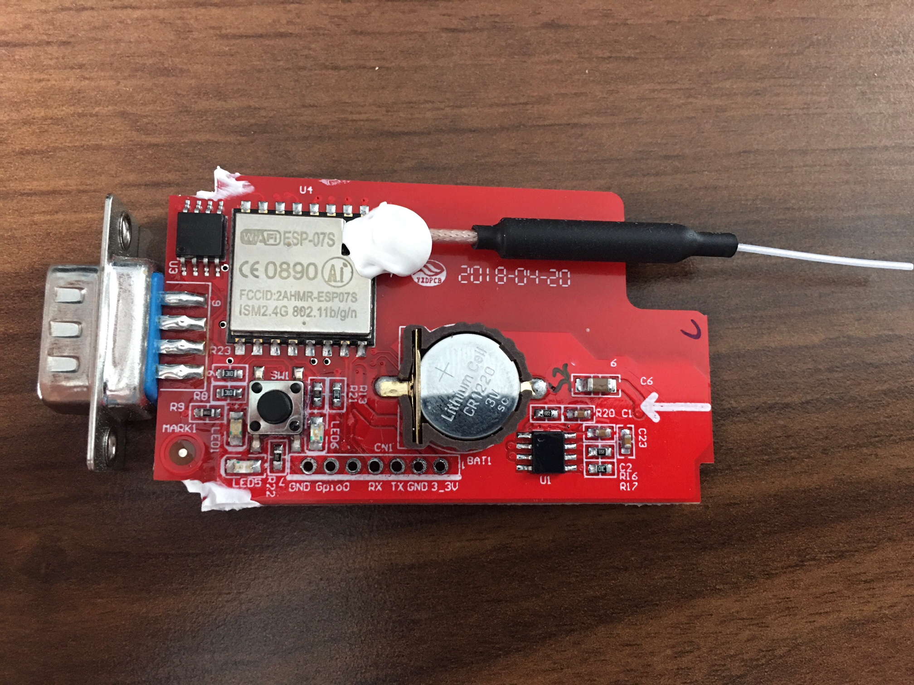

# Growatt-Shine-Wifi-Stick-MQTT
This is an alternative firmware for the Growatt Shine Wifi Stick which sends the data of a Growatt inverter to an MQTT broker
## About
The aim of this project is to get rid of the cloud-dependency of the Growatt Shine Wifi Stick. This firmware sends the data of a Growatt inverter to an MQTT broker



## Wiring
You need an FTDI adapter to flash the firmware, ensure that it's set to 3.3V. Connect the pins of the FTDI adapter to the corresponding ones on the Growatt PCB (really connect RX to RX and TX to TX, otherwise depending on your FTDI adapter connection might fail). Additionally, the pins GND and Gpio0 on the Growatt PCB have to be connected with a 220 ohm resistor (other ones might work as well) while booting/flashing.

## Backup original firmware
I recommend creating a backup of the original firmware with the help of [esptool.py](https://github.com/espressif/esptool), just in case you ever want to switch back.
```bash
esptool.py -b 115200 --port /dev/ttyUSB0 read_flash 0x00000 0x400000 original_firmware.bin
```

## Restore original firmware
If you want to switch back to the original firmware...
```bash
esptool.py --port /dev/ttyUSB0 write_flash 0x00000 ./original_firmware.bin
```

## Using your IDE for building and flashing
You should be able to use your preferred IDE to build and flash if you take care of the dependencies and the build flags configured in the `platform.io` file. I strongly recommend using PlatformIO as it takes care of that itself.

### Configuration
The configuration of the Wifi credentials and MQTT settings are done by editing `src/secrets.h`.

```c++
#define WIFI_SSID ""
#define WIFI_PASSWORD ""
#define WIFI_HOSTNAME "GrowattStick"

#define MQTT_SERVER "192.168.178.57"
#define MQTT_PORT 1883
#define MQTT_USERNAME ""
#define MQTT_PASSWORD ""
```
When using PlatformIO set the `upload_port` in `platformio.ini` to the one of your FTDI adapter.

## References
Code structure based on: https://github.com/timjong93/growatt_mqtt
